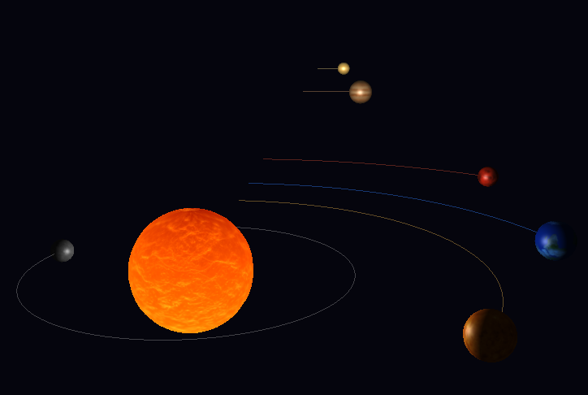

# Gravity Simulator

Real-time N-Body gravitational simulation of the Solar System built from scratch with **OpenGL 3.3**, **C++20**, **GLFW** and **GLM** — no game engine, custom physics integrator, hand-rolled renderer.



## Features

- N-Body physics using Newton's Law of Universal Gravitation
- Symplectic (semi-implicit) Euler integration for long-term orbital stability
- Per-body orbital trail rendering with a GPU ring buffer
- Physically-based Blinn-Phong lighting driven by the Sun's position
- Free-fly camera (WASD + mouse)
- Pause / resume / reset simulation
- Real-time time-scale control (arrow keys)

## Controls

| Key           | Action                     |
|---------------|----------------------------|
| WASD          | Move camera                |
| Mouse         | Look around                |
| Scroll wheel  | Zoom                       |
| Space / Shift | Move camera up / down      |
| P             | Pause / Resume             |
| T             | Toggle orbital trails      |
| R             | Reset simulation           |
| ↑ / ↓         | Speed up / slow down       |
| ESC           | Exit                       |

## Build

**Requirements:** CMake 3.16+, Git, C++20 compiler (GCC 10+, Clang 12+, MSVC 2019+)

```bash
git clone https://github.com/xrroman/gravity-simulator.git
cd gravity-simulator
cmake -B build -DCMAKE_BUILD_TYPE=Release
cmake --build build
./build/GravitySimulator
```

> GLFW and GLM are fetched automatically by CMake FetchContent — no manual installation needed.

## Architecture

The project follows an MVC pattern with a clean separation of concerns:

```
src/
├── controller/
│   └── App          — Main loop, input handling, ties model ↔ view
├── model/
│   ├── Body         — Physics state (position, velocity, mass)
│   ├── Simulation   — N-Body integration (O(n²) brute force)
│   ├── Camera       — Free-fly camera (yaw/pitch Euler)
│   └── SphereGeometry — UV-sphere mesh generation
└── view/
    ├── Shader       — GLSL program compilation & uniform setters
    ├── Mesh         — VAO/VBO/EBO wrapper
    ├── Trail        — Orbital trail renderer (dynamic GPU ring buffer)
    ├── TextureLoader — stb_image → GL texture RAII wrapper
    └── Window       — GLFW window + context RAII wrapper
```

## Unit System

The simulation uses a self-consistent unit system with G = 1:

| Quantity | Unit |
|----------|------|
| Distance | 0.1 AU per world unit |
| Time     | ~31.6 real seconds = 1 simulated Earth year |
| Mass     | Scaled so G × M☉ = 39.535 |

## Dependencies (auto-downloaded)

- [GLFW 3.3.9](https://github.com/glfw/glfw) window & input
- [GLM 1.0.1](https://github.com/g-truc/glm) math
- GLAD (vendored) OpenGL loader
- stb_image (vendored) texture loading
