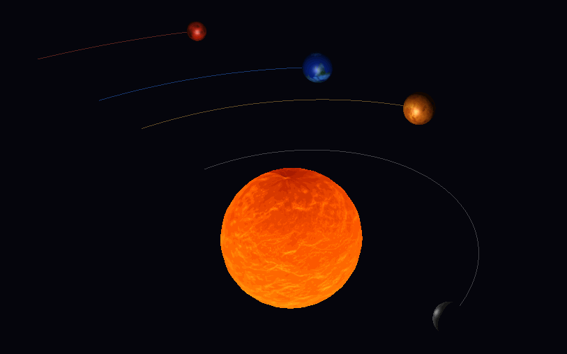

# Gravity Simulator

A real-time N-Body gravitational simulation of the Solar System built from scratch in C++20 with OpenGL 3.3, GLFW, and GLM. No game engine, custom physics integrator and hand-rolled renderer.





## Features

- Real-time N-Body gravitational simulation of the Solar System
- Per-body orbital trail rendering
- Physically-based lighting driven by the Sun's position
- Free-fly camera (WASD + mouse look)
- Pause, resume, and reset simulation
- Real-time time-scale control

## Architecture

The project follows an MVC pattern with a strict separation between physics state and rendering.

```
src/
├── controller/
│   └── App              — Main loop, input handling, ties Model ↔ View
├── model/
│   ├── Body             — Physics state (position, velocity, mass)
│   ├── Simulation       — N-Body integration (O(n²) brute force)
│   ├── Camera           — Free-fly camera (yaw/pitch Euler)
│   └── SphereGeometry   — UV-sphere mesh generation
└── view/
    ├── Shader           — GLSL program compilation & uniform setters
    ├── Mesh             — VAO/VBO/EBO wrapper
    ├── Trail            — Orbital trail renderer (dynamic GPU ring buffer)
    ├── TextureLoader    — stb_image → GL texture RAII wrapper
    └── Window           — GLFW window + context RAII wrapper
```

`App` (Controller) owns one `Simulation` and a parallel `std::vector<BodyRenderer>`, keeping physics and rendering data decoupled. GLFW callbacks are static functions that recover the `App*` via `glfwGetWindowUserPointer`, avoiding globals. The main loop runs a fixed `processInput → update → render` sequence each frame.

`Simulation` (Model) separates acceleration computation from integration into two private methods (`computeAccelerations` / `integrate`), making it straightforward to swap integrators. Bodies flagged `isStatic` are skipped during integration, letting the Sun act as a fixed anchor without special-casing the physics.

`Trail` (View) pre-allocates a fixed GPU buffer (`GL_DYNAMIC_DRAW`) at construction time. Points are stored in a `std::deque` capped at 512 entries; only the flattened range is uploaded via `glBufferSubData` each frame, avoiding full reallocations. All OpenGL resources are managed with RAII — the destructor calls `glDeleteVertexArrays` and `glDeleteBuffers`.

## Unit System

Self-consistent unit system with G = 1:

| Quantity | Unit |
|----------|------|
| Distance | 0.1 AU per world unit |
| Time     | ~31.6 real seconds = 1 simulated Earth year |
| Mass     | Scaled so G × M☉ = 39.535 |

## Controls

| Key            | Action                    |
|----------------|---------------------------|
| WASD           | Move camera               |
| Mouse          | Look around               |
| Scroll wheel   | Zoom                      |
| Space / Shift  | Move camera up / down     |
| P              | Pause / Resume            |
| T              | Toggle orbital trails     |
| R              | Reset simulation          |
| ↑ / ↓          | Speed up / slow down      |
| ESC            | Exit                      |

## Build

**Requirements:** CMake 3.16+, C++20 compiler (GCC 10+, Clang 12+, MSVC 2019+)

```bash
git clone https://github.com/xrroman/GravitySimulator.git
cd GravitySimulator
cmake -B build -DCMAKE_BUILD_TYPE=Release
cmake --build build
./build/GravitySimulator
```

GLFW and GLM are fetched automatically via CMake FetchContent — no manual installation needed.

## Dependencies

- [GLFW 3.3.9](https://github.com/glfw/glfw) — window & input
- [GLM 1.0.1](https://github.com/g-truc/glm) — math
- GLAD (vendored) — OpenGL loader
- stb_image (vendored) — texture loading